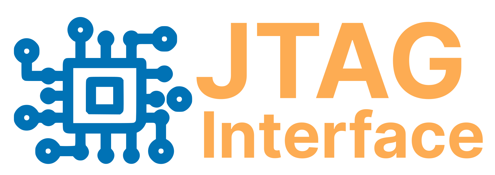
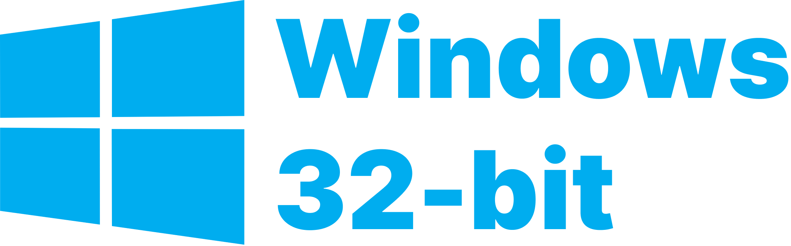
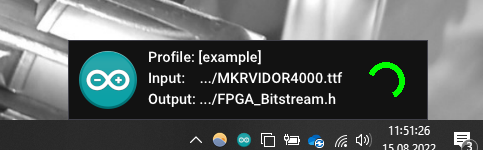
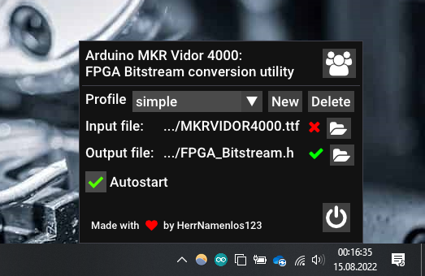

<p align="center">
<table>
<td>
<h1>Helper utility for:</h2>
</td>

<td>
<a href="https://github.com/HerrNamenlos123/JTAG_Interface">

</a>
</td>
</table>
</p>

# Byte reverser 💻

When developing FPGA programs for the Arduino MKR Vidor 4000 it is a great question how to upload the bitstream to the FPGA part of the Arduino.  

This application takes care of it to make development as smooth for you as possible.

## How to get

On Windows, you can just download the latest release.  
Click on this image to download the installer:

<a href="https://github.com/HerrNamenlos123/bytereverse/releases/latest/download/ByteReverser.exe">
</a>

Currently the GUI is Windows-only and 32 bit for maximum compatibility. The Linux GUI might be coming in the future, please let me know if you want it, so i know if there is interest!

For now, Linux users can use the CLI tool directly, for that just build the utility in the subfolder `bytereverse`, then just use it like any other command line utility. You will find out how to use it.

The CLI-tool can be built on any platform:
```
cd bytereverse
mkdir build
cd build
cmake .. -DONLY_CLI=true
cmake --build .
```

## Installing

This application will install itself as soon as you start it. Just double-click the executable and see what happens. It does not use administrative rights, so you can install it on any computer you like. It is not a full-fledged installer as it wouldn't be necessary, so you won't have luck trying to uninstall it.

In the rare case that you would want to uninstall it, you must do it manually by navigating to `%LOCALAPPDATA%/ArduinoByteReverser` and `%APPDATA%/ArduinoByteReverser` and deleting both folders. That's it.

## Why do we need this?

Intel Quartus generates an output file `MKRVIDOR4000.ttf` or similar, that we need to upload to the Arduino's FPGA, but it is not in the right format yet, it is bit-reversed.  

This utility converts the file to the right format and writes it to a `FPGA_Bitstream.h` file, which is then included in your Arduino program. 

## What does it do?

When you start the application, a tray icon will appear. Right-clicking it will open the options UI where you can create a profile and choose the input and output files. After that, you can left-click the tray icon to immediately convert the file.

<p align="center"><table>
<td valign="bottom"></td>
<td valign="bottom"></td>
</table></p>

This immensely speeds up your workflow, as you only need to build the Quartus project, click once in the taskbar and can immediately upload the Arduino project, no more file copying.

There is also an instant feedback feature, where you can write me any messages if you think I could improve something. There is a Telegram bot under the hood, which directly sends me your message. Please do make use of it and tell me of any bugs or improvements I could make.

## Support 💪

I do all of my projects in my free time and I do not get any money for that. I just like what I do, do it for myself and want to share it so that others can benefit too.

I like to drink beer and any support is greatly apprechiated :)

<a href="https://www.buymeacoffee.com/herrnamenlos123"></a>
